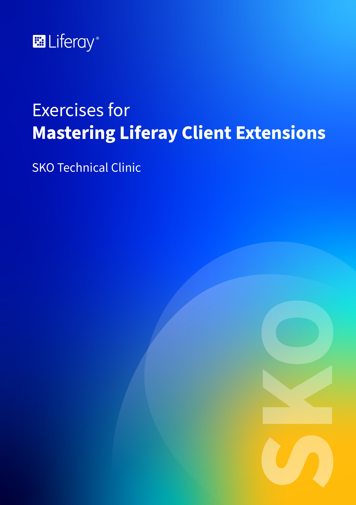

# Exercises for Mastering Liferay Client Extensions - SKO 2025 Edition

## Table of Contents

* [Exercise 1: Exporting the Contact Us Object Definition](#exercise-1-exporting-the-contact-us-object-definition)
* [Exercise 2: Creating and Deploying a Batch Client Extension](#exercise-2-creating-claritys-ticketing-batch-client-extension)
* [Exercise 3: Deploying Clarity’s Ticketing Application](#exercise-3-deploying-claritys-ticketing-application)

## Exercise 1: Exporting the Contact Us Object Definition

Here, you'll export Clarity's Contact Us object definition and explore its associated JSON file.

1. In your running Liferay instance, sign in as the Clarity Admin user.

   * Username: `admin@clarityvisionsolutions.com`
   * Password: `learn`

1. Open the *Global Menu* (), go to the *Control Panel* tab, and click *Objects*.

1. Click *Actions* () for the Contact Us object and select *Export Object Definition*.

   

1. Open the downloaded `Object_Definition_ContactUs_[...].json` file in a text editor or IDE.

   **Note**: Many text editors and IDEs offer extensions to “prettify” JSON code, improving its readability for human comprehension.

1. Examine its contents and observe [...].

<!-- TODO: Determine what the user should explore in the file for the step above. -->

Great! You have successfully exported one of Clarity’s object definitions and have learned a bit about its JSON structure. While this exercise leveraged the Contact Us object to demonstrate the necessary process to prepare for creating a batch client extension, Clarity's development team has created a Ticketing app on a lower environment that they need to migrate to other environments. Next, you’ll learn how to package the JSON for Clarity’s Ticketing app into a batch client extension.

## Exercise 2: Creating Clarity’s Ticketing Batch Client Extension

Here, you'll create a batch client extension containing the definition and related resources for Clarity’s Ticketing app.

1. Open a file explorer and navigate to the `exercises/exercise-2/` folder in your course workspace.

1. Rename the `liferay-sample-batch` folder to `liferay-clarity-ticket-batch`.

   **Note**: The `liferay-sample-batch` client extension was downloaded from the [Liferay Sample Workspace](https://github.com/liferay/liferay-portal/tree/master/workspaces/liferay-sample-workspace). As a best practice, use examples within this workspace as the baseline for your own client extension projects, as this serves as the primary source of truth for client extension implementation.

1. Navigate to the `liferay-clarity-ticket-batch/` folder.

1. Delete all files within the `batch` folder.

   This removes the sample client extension data to accommodate Clarity’s Ticketing app content.

1. Open the `client-extension.yaml` file in a text editor or IDE.

   You'll define the batch client extension configuration in this file.

<!-- The next 3 steps are SKO-specific. -->

1. From the `exercise-2` folder, open the `ticket-batch-configuration.txt` file.

   This file contains the necessary configuration for the Ticketing app client extension.

1. Compare both files to spot the differences.

1. Replace the `client-extension.yaml` file's existing content with the code in the `ticket-batch-configuration.txt` file.

1. Save the file.

1. From the `exercise-2` folder, move these files into the `liferay-clarity-ticket-batch/batch/` folder:

   * `00-list-type-definition.batch-engine-data.json`
   * `01-object-definition.batch-engine-data.json`
   * `02-object-relationship.batch-engine-data.json`
   * `03-object-entry.batch-engine-data.json`

   With this, the client extension will create a picklist, the Ticket object definition, a relationship, and some Ticket entries upon deployment.

1. Move the `liferay-clarity-ticket-batch/` folder into the `client-extensions/` folder of your course workspace.

Great! Now that you've fully configured the batch client extension and moved it to the appropriate workspace location, you can deploy it into your Liferay environment.

## Exercise 3: Deploying Clarity’s Ticketing Application

Here, you’ll deploy the previous exercise’s batch client extension to migrate Clarity’s Ticketing app.

1. Open a terminal and navigate to the `client-extensions/liferay-clarity-ticket-batch/` in your course workspace.

1. Run this command to build and deploy the client extension:

   ```bash
   blade gw clean deploy
   ```

1. Verify it deploys successfully.

   ```log
   2025-01-13 14:33:19.157 INFO  [fileinstall-directory-watcher][BundleStartStopLogger:68] STARTED liferayclarityticketbatch_7.4.13 [1484]
   ```

   Now that you've deployed the batch client extension, you can examine the migrated data model.

1. In your Liferay instance, sign in as the Clarity Admin user.

   * Username: `admin@clarityvisionsolutions.com`
   * Password: `learn`

1. Open the *Global Menu* (), go to the *Control Panel* tab, and click *Objects*.

1. Verify that the `Ticket` object definition is present.

1. In the Global Menu (), go to the *Control Panel* tab and click *Picklists*.

1. Verify that these picklists were created:

   * Priorities
   * Regions
   * Resolutions
   * Statuses
   * Types

1. In the Global Menu (), go to the *Control Panel* tab and click *Tickets*.

1. Verify that the sample Ticket entries were created.

Great! You've successfully created and deployed the batch clarity extension to migrate Clarity’s Ticketing app.
